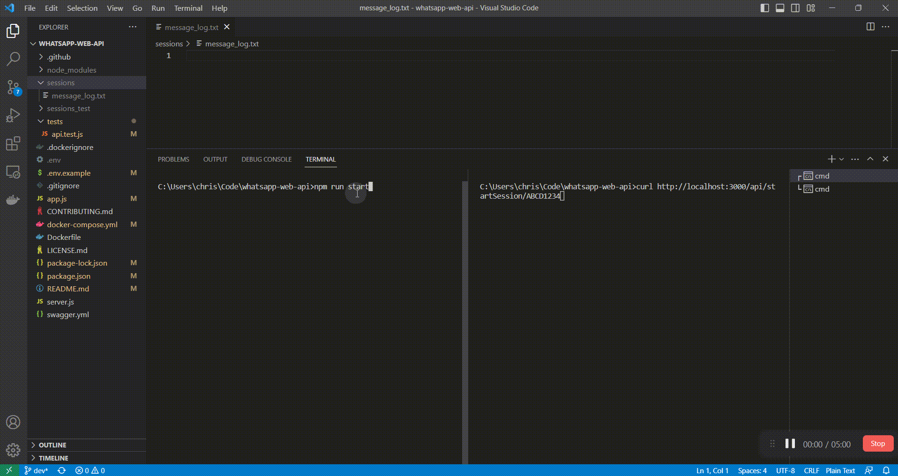

# WhatsApp REST API

REST API wrapper for the [whatsapp-web.js](https://github.com/pedroslopez/whatsapp-web.js) library, providing an easy-to-use interface to interact with the WhatsApp Web platform. 
It is designed to be used as a docker container, scalable, secure, and easy to integrate with other non-NodeJs projects.

This project is a work in progress: star it, create issues, features or pull requests ❣️

**NOTE**: I can't guarantee you will not be blocked by using this method, although it has worked for me. WhatsApp does not allow bots or unofficial clients on their platform, so this shouldn't be considered totally safe.

## Table of Contents

[1. Quick Start with Docker](#quick-start-with-docker)

[2. Features](#features)

[3. Run Locally](#run-locally)

[4. Testing](#testing)

[5. Documentation](#documentation)

[6. Deploy to Production](#deploy-to-production)

[7. Contributing](#contributing)

[8. License](#license)

[9. Star History](#star-history)

## Quick Start with Docker

[](https://hub.docker.com/r/chrishubert/whatsapp-web-api)

1. Clone the repository:

```bash
git clone https://github.com/chrishubert/whatsapp-api.git
cd whatsapp-api
```

3. Run the Docker Compose:

```bash
docker-compose pull && docker-compose up
```
4. Visit http://localhost:3000/session/start/ABCD

5. Scan the QR on your console using WhatsApp mobile app -> Linked Device -> Link a Device (it may take time to setup the session)

6. Visit http://localhost:3000/client/getContacts/ABCD

7. EXTRA: Look at all the callbacks data in `./session/message_log.txt`



## Features

1. API and Callbacks

| Actions                      | Status | Sessions                                | Status | Callbacks                                      | Status |
| ----------------------------| ------| ----------------------------------------| ------| ----------------------------------------------| ------|
| Send Image Message           | ✅     | Initiate session                       | ✅    | Callback QR code                               | ✅     |
| Send Video Message           | ✅     | Terminate session                      | ✅    | Callback new message                           | ✅     |
| Send Audio Message           | ✅     | Terminate inactive sessions            | ✅    | Callback status change                         | ✅     |
| Send Document Message        | ✅     | Terminate all sessions                 | ✅    | Callback message media attachment              | ✅     |
| Send File URL                | ✅     | Healthcheck                            | ✅    |                                                |        |
| Send Button Message          | ✅     | Local test callback                    |        |                                                |        |
| Send Contact Message         | ✅     |                                        |        |                                                |        |
| Send List Message            | ✅     |                                        |        |                                                |        |
| Set Status                   | ✅     |                                        |        |                                                |        |
| Send Button With Media       | ✅     |                                        |        |                                                |        |
| Is On Whatsapp?              | ✅     |                                        |        |                                                |        |
| Download Profile Pic         | ✅     |                                        |        |                                                |        |
| User Status                  | ✅     |                                        |        |                                                |        |
| Block/Unblock User           | ✅     |                                        |        |                                                |        |
| Update Profile Picture       | ✅     |                                        |        |                                                |        |
| Create Group                 | ✅     |                                        |        |                                                |        |
| Leave Group                  | ✅     |                                        |        |                                                |        |
| All Groups                   | ✅     |                                        |        |                                                |        |
| Invite User                  | ✅     |                                        |        |                                                |        |
| Make Admin                   | ✅     |                                        |        |                                                |        |
| Demote Admin                 | ✅     |                                        |        |                                                |        |
| Group Invite Code            | ✅     |                                        |        |                                                |        |
| Update Group Participants    | ✅     |                                        |        |                                                |        |
| Update Group Setting         | ✅     |                                        |        |                                                |        |
| Update Group Subject         | ✅     |                                        |        |                                                |        |
| Update Group Description     | ✅     |                                        |        |                                                |        |

3. Handle multiple client sessions (session data saved locally), identified by unique id

4. All endpoints may be secured by a global API key

5. On server start, all existing sessions are restored

6. Set messages automatically as read

7. Disable any of the callbacks

## Run Locally

1. Clone the repository:

```bash
git clone https://github.com/chrishubert/whatsapp-api.git
cd whatsapp-api
```

2. Install the dependencies:

```bash
npm install
```

3. Copy the `.env.example` file to `.env` and update the required environment variables:

```bash
cp .env.example .env
```

4. Run the application:

```bash
npm run start
```

5. Access the API at `http://localhost:3000`

## Testing

Run the test suite with the following command:

```bash
npm run test
```

## Documentation

API documentation can be found in the [`swagger.json`](https://raw.githubusercontent.com/chrishubert/whatsapp-api/master/swagger.json) file. See this file directly into [Swagger Editor](https://editor.swagger.io/?url=https://raw.githubusercontent.com/chrishubert/whatsapp-api/master/swagger.json) or any other OpenAPI-compatible tool to view and interact with the API documentation.

This documentation is straightforward if you are familiar with whatsapp-web.js library (https://docs.wwebjs.dev/)
If you are still confused - open an issue and I'll improve it.

Also, there is an option to run the documentation endpoint locally by setting the `ENABLE_SWAGGER_ENDPOINT` environment variable. Restart the service and go to `/api-docs` endpoint to see it.

By default, all callback events are delivered to the webhook defined with the `BASE_WEBHOOK_URL` environment variable.
This can be overridden by setting the `*_WEBHOOK_URL` environment variable, where `*` is your sessionId.
For example, if you have the sessionId defined as `DEMO`, the environment variable must be `DEMO_WEBHOOK_URL`.

By setting the `DISABLED_CALLBACKS` environment variable you can specify what events you are **not** willing to receive on your webhook.

### Scanning QR code

In order to validate a new WhatsApp Web instance you need to scan the QR code using your mobile phone. Official documentation can be found at (https://faq.whatsapp.com/1079327266110265/?cms_platform=android) page. The service itself delivers the QR code content as a webhook event or you can use the REST endpoints (`/session/qr/:sessionId` or `/session/qr/:sessionId/image` to get the QR code as a png image). 

## Deploy to Production

- Load the docker image in docker-compose, or your Kubernetes environment
- Disable the `ENABLE_LOCAL_CALLBACK_EXAMPLE` environment variable
- Set the `API_KEY` environment variable to protect the REST endpoints
- Run periodically the `/api/terminateInactiveSessions` endpoint to prevent useless sessions to take up space and resources(only in case you are not in control of the sessions)

## Contributing

Please read [CONTRIBUTING.md](./CONTRIBUTING.md) for details on our code of conduct, and the process for submitting pull requests to us.

## Disclaimer

This project is not affiliated, associated, authorized, endorsed by, or in any way officially connected with WhatsApp or any of its subsidiaries or its affiliates. The official WhatsApp website can be found at https://whatsapp.com. "WhatsApp" as well as related names, marks, emblems and images are registered trademarks of their respective owners.

## License

This project is licensed under the MIT License - see the [LICENSE.md](./LICENSE.md) file for details.

## Star History

[](https://star-history.com/#chrishubert/whatsapp-api&Date)
